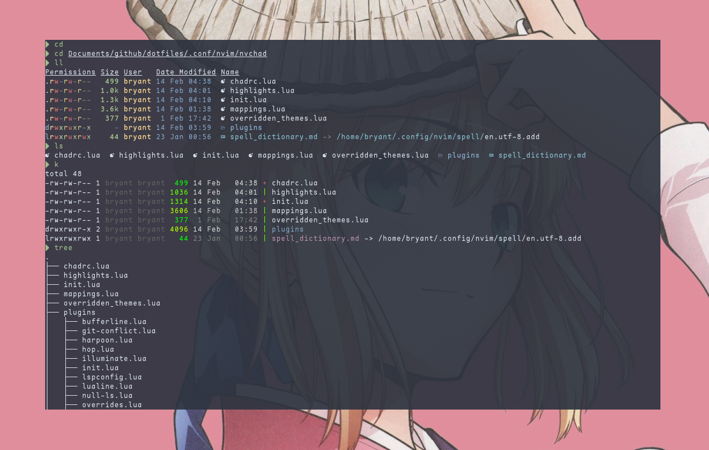
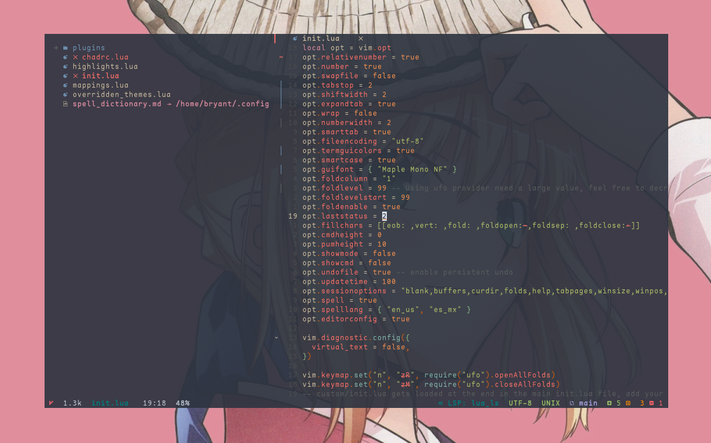
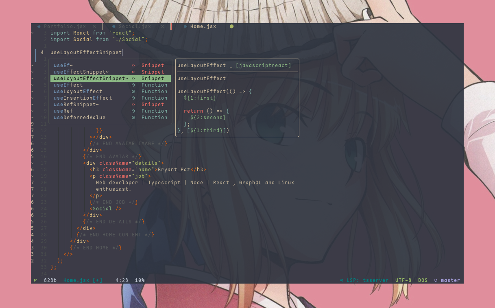

# Bryant's dotfiles

<!--toc:start-->

- [Bryant's dotfiles](#bryants-dotfiles)
  - [Looking for an custom IDE?](#looking-for-an-custom-ide)
  - [Contents](#contents)
  - [Neovim setup](#neovim-setup)
  - [Shell setup](#shell-setup)
  - [How to use](#how-to-use)
  - [About me](#about-me)
  <!--toc:end-->

**Warning**: Don’t blindly use my settings unless you know what that entails.
Use at your own risk!

## Looking for an custom IDE?

## Contents

- vim (NeoVim) config
- tmux config
- alacritty config
- kitty config
- zsh config
- git config
- aliases config
- customization (linux mint)
- list of software
- other configs

## Neovim setup

Requires [Neovim](https://neovim.io/) (>= 0.8)

- [wbthomason/packer.nvim](https://github.com/wbthomason/packer.nvim) - A plugin manager for Neovim
- [svrana/neosolarized.nvim](https://github.com/svrana/neosolarized.nvim) - A truecolor, solarized dark colorscheme
- [nvim-lualine/lualine.nvim](https://github.com/nvim-lualine/lualine.nvim) - A blazing fast and easy to configure Neovim statusline written in Lua
- [onsails/lspkind-nvim](https://github.com/onsails/lspkind-nvim) - VSCode-like pictograms
- [L3MON4D3/LuaSnip](https://github.com/L3MON4D3/LuaSnip) - Snippet Engine for Neovim written in Lua
- [hrsh7th/cmp-nvim-lsp](https://github.com/hrsh7th/cmp-nvim-lsp) - nvim-cmp source for neovim's built-in LSP
- [hrsh7th/cmp-buffer](https://github.com/hrsh7th/cmp-buffer) - nvim-cmp source for buffer words
- [hrsh7th/nvim-cmp](https://github.com/hrsh7th/nvim-cmp) - A completion engine plugin for neovim written in Lua
- [neovim/nvim-lspconfig](https://github.com/neovim/nvim-lspconfig) - A collection of configurations for Neovim's built-in LSP
- [jose-elias-alvarez/null-ls.nvim](https://github.com/jose-elias-alvarez/null-ls.nvim) - Use Neovim as a language server to inject LSP diagnostics, code actions, and more via Lua.
- [williamboman/mason.nvim](https://github.com/williamboman/mason.nvim) - Portable package manager for Neovim that runs everywhere Neovim runs. Easily install and manage LSP servers, DAP servers, linters, and formatters
- [williamboman/mason-lspconfig.nvim](https://github.com/williamboman/mason-lspconfig.nvim) - Extension to mason.nvim that makes it easier to use lspconfig with mason.nvim
- [nvim-treesitter/nvim-treesitter](https://github.com/nvim-treesitter/nvim-treesitter) - [Treesitter](https://github.com/tree-sitter/tree-sitter) configurations and abstraction layer for Neovim
- [kyazdani42/nvim-web-devicons](https://github.com/kyazdani42/nvim-web-devicons) - Lua `fork` of vim-web-devicons for neovim
- [nvim-telescope/telescope.nvim](https://github.com/nvim-telescope/telescope.nvim) - A highly extendable fuzzy finder over lists
- [nvim-telescope/telescope-file-browser.nvim](https://github.com/nvim-telescope/telescope-file-browser.nvim) - File Browser extension for telescope.nvim
- [windwp/nvim-autopairs](https://github.com/windwp/nvim-autopairs) - Autopairs
- [windwp/nvim-ts-autotag](https://github.com/windwp/nvim-ts-autotag) - Use treesitter to auto close and auto rename html tag
- [norcalli/nvim-colorizer.lua](https://github.com/norcalli/nvim-colorizer.lua) - A high-performance color highlighter
- [akinsho/nvim-bufferline.lua](https://github.com/akinsho/nvim-bufferline.lua) - A snazzy bufferline
- [lewis6991/gitsigns.nvim](https://github.com/lewis6991/gitsigns.nvim) - Git integration for buffers
- [dinhhuy258/git.nvim](https://github.com/dinhhuy258/git.nvim) - A simple clone of the plugin vim-fugitive
- [iamcco/markdown-preview.nvim](https://github.com/iamcco/markdown-preview.nvim) - Markdown live preview

## Shell setup

- [Nerd fonts](https://github.com/ryanoasis/nerd-fonts) - Powerline-patched fonts. I use Hack.
- [Exa](https://the.exa.website/) - `ls` replacement

## How to use

- [NvChad](https://docs.rockylinux.org/books/nvchad)

## About me

- [Twitter](https://twitter.com/plbryantt)
- [Instagram](https://www.instagram.com/pazita117)
- [Linkedin](https://www.linkedin.com/in/bryant-paz-53a9471b1)
