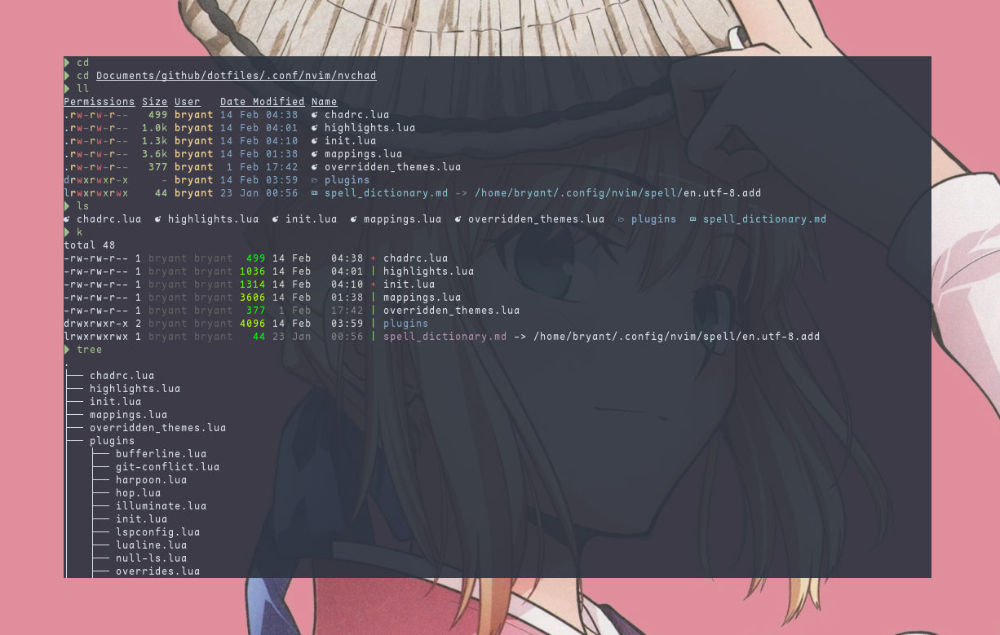
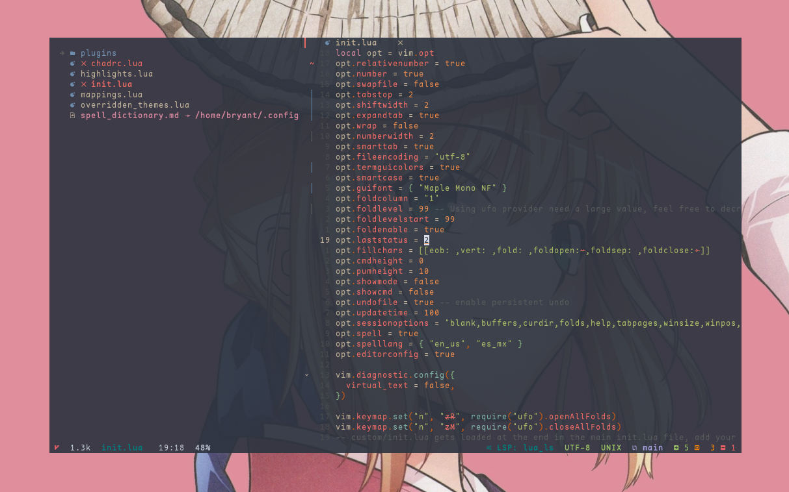
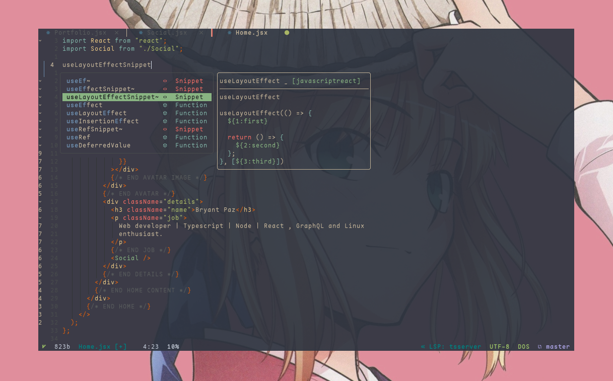

# Bryant's dotfiles

<!--toc:start-->

- [Bryant's dotfiles](#bryants-dotfiles)
  - [Looking for an custom IDE?](#looking-for-an-custom-ide)
  - [Contents](#contents)
  - [Neovim setup](#neovim-setup)
  - [How to use](#how-to-use)
  - [About me](#about-me)
  <!--toc:end-->

**Warning**: Don’t blindly use my settings unless you know what that entails.
Use at your own risk!

**Warning** Some configurations may need programming languages installed locally
such as golang, rust/cargo and others, keep that in mind!

## Looking for an custom IDE?

## Contents

- Neovim configuration
- Font
- How to use
- About me

## Neovim setup

Requires [Neovim](https://neovim.io/) (>= 0.8)

- [NvChad/NvChad](https://github.com/NvChad/NvChad) - Blazing fast Neovim config providing solid defaults and a beautiful UI, enhancing your neovim experience.
- [nvim-treesitter/nvim-treesitter](https://github.com/nvim-treesitter/nvim-treesitter) - Nvim Treesitter configurations and abstraction layer
- [sharkdp/fd](https://github.com/sharkdp/fd) - Improved fzf.vim written in lua
- [BurntSushi/ripgrep](https://github.com/BurntSushi/ripgrep) - ripgrep recursively searches directories for a regex pattern while respecting your gitignore

## Font

Requires [Maple Mono](https://github.com/subframe7536/Maple-font)

## How to use

- [NvChad](https://nvchad.com/docs/config/walkthrough)

## About me

- [Twitter](https://twitter.com/plbryantt)
- [Instagram](https://www.instagram.com/pazita117)
- [Linkedin](https://www.linkedin.com/in/bryant-paz-53a9471b1)
